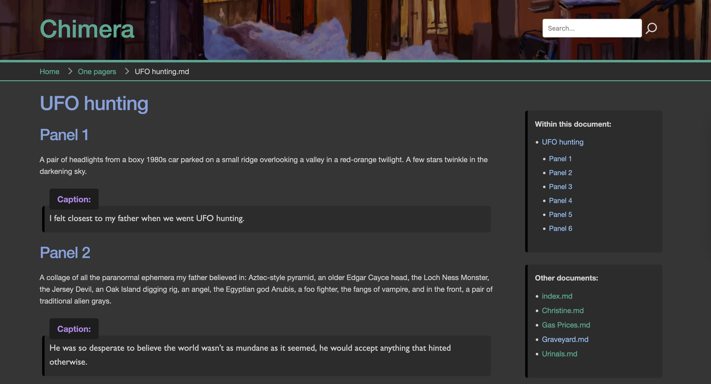

# Chimera-md


Chimera-md is a [Markdown](https://www.markdownguide.org/)-aware documentation server.

I have spent years developing a hard drive full of notes and documents written in the
Markdown text processing language, and while it is comparatively easy to view them as
intended in a special editor, most often I would wind up seeing them in plain text form.
I went looking for a server I could host that would serve up HTML-ified versions of
those documents transparently. Most of the tools I found were static site generators,
or had strong opinions about how the document should be formatted.

Chimera-md is my attempt to make a very simple web server that understands and can serve
a library of Markdown files (and supporting assets). It is a full web server
and can handle ordinary files but has special processing for Markdown files.

It is named after the mythical [chimera](https://en.wikipedia.org/wiki/Chimera_(mythology)),
a beast with at least two heads (and sometimes many more!). It represents the multiple
presentations of these files. Looked at one way, they are plain text. Looked at another,
they are fancy HTML.

## Goals

1. Transparently serve Markdown files
2. Built on top of an existing speedy [web server framework](https://docs.rs/axum/latest/axum/)
3. Nice-looking theme
4. Simple site navigation
5. Full text search
6. Syntax highlighting for code blocks
7. Updates automatically when files change

## Installation

The intended way to install is via [Docker](https://hub.docker.com/repository/docker/acbarrentine/chimera-md/general).
The Docker Compose file is probably the easiest way to get going. The version below should
get you going, but the [one on Github](https://github.com/acbarrentine/chimera-md/blob/main/compose.yaml)
will probably be more up to date.

```yaml
version: '3.8'
services:
  chimera-md:
    container_name: chimera-md
    platform: linux/amd64
    image: acbarrentine/chimera-md:latest
    ports:
      - "8080:8080"

    volumes:
      # /data/www is the web root -- Point this to your main documents folder
      - /usr/data/user1/documents:/data/www:ro

      # /data/search is where the full text indexer writes its work files
      # These are persisted to optimize server startup times
      - /docker/chimera-md/search:/data/search

      # You may want to map an images folder
      - /usr/data/user1/media:/data/www/images:ro

      # You can map in a favicon, if you'd like
      # - /usr/data/user1/images/logo.png:/data/www/favicon.ico:ro

      # Optional extra document directories can be added to the web root
      # - /usr/data/user1/notes:/data/www/notes:ro

      # Similarly, you can map additional image directories
      # - /usr/data/user1/icons:/data/www/images/icons:ro

      # If you use plug-ins, scripts for them will be loaded from /data/www/script
      # - /volume1/docker/chimera-md/script:/data/www/script:ro

    environment:
      # Chimera provides a number of environment variable-based configuration options. Only a few
      # are relevant to Docker installations. If you would like, these can be offloaded into a file
      # named .env, placed next to this compose.yaml file

      # Site title appears in the <title> tags of served pages
      # Default is "Chimera-md"
      - CHIMERA_SITE_TITLE=Chimera-md

      # What is the name of the index file to serve for a folder URL?
      # Default is "index.md"
      - CHIMERA_INDEX_FILE=index.md

      # HTML lang tag
      # Used as <html lang="site_lang">
      # See <https://www.w3.org/International/questions/qa-html-language-declarations> for details
      # Default is "en"
      - CHIMERA_SITE_LANG=en

      # What code block highlight style should we use?
      # Syntax highlighting provided by highlight.js
      # Styles available listed at: https://github.com/highlightjs/highlight.js/tree/main/src/styles
      # Default is "an-old-hope"
      - CHIMERA_HIGHLIGHT_STYLE=an-old-hope

      # Tracing log level. In descending verbosity, options are TRACE, DEBUG, INFO, WARN, ERROR
      # Case matters
      # Default is INFO
      - CHIMERA_LOG_LEVEL=INFO

      # If a directory doesn't contain an index.md file, should we generate one?
      # Default is false
      - CHIMERA_GENERATE_INDEX=true

      # Maximum size (in bytes) for the HTML page cache
      # Default is 52428800 (50 MBs)
      - CHIMERA_MAX_CACHE_SIZE=52428800

    restart: unless-stopped
```

Note that while Chimera-md is a web server, it is not trying to solve all problems a web server
can be asked. There is no CGI plug-in model. It doesn't handle SSL (TLS) certificates. If you
want authenticated traffic (and you probably do!), you should run it behind a reverse proxy like
[nginx](https://nginx.org/en/) or [Traefik](https://traefik.io/). 

## Managing documents

If you, like me, haven't been putting files in any semblance of order as they accumulate, you
might feel at a loss how to make a single folder that indexes them all. And that's what the web
root is — the starting point for serving up all your documents.

The basic organizational structure you'll want is an `index.md` file in each interesting directory
that points to the files you want to show and to the other folders you want to have reachable from
there. This doesn't have to be a tree structure, but that's a good way to start. If you don't have
an index file, but CHIMERA_GENERATE_INDEX is set to `true`, the server will make a best guess from
the contents of a folder (showing anything with a .md extension). That setting will also populate
a sidebar panel on markdown documents linking to discovered peers. Consider dressing up your index
documents with pictures to make them look sharp!

If you don't have a tree-like structure, you can use Docker volume mappings to invent one. As long
as mappings don't target the same exact Docker directory, they can overlap however you'd like. I
have a bunch of Synology "shared folder" mount points mapped into the one document folder, which
presents as a very serve-able tree.


In Docker, the left side of the mapping is the real, physical path; the right side is how it
presents in the container. Supposing you have a home directory that contains your main documents
folder, you could map it this way:

```yaml
    volumes:
      - /users/fancy/documents:/data/www
```

Then add additional folders in by creating sub-folder mappings:

```yaml
      - /users/wifey/budget:/data/www/budget
      - /users/kiddo/minecraft:/data/www/minecraft
```

You can also target specific files

```yaml
      - /users/fancy/automation/readme.md:/data/www/automation.md
```

Note that while the focus of Chimera-md is serving Markdown files, it is a fully capable web
server. Feel free to add other kinds of documents or assets to your pages. Only Markdown files
will be discovered by the full-text indexer, however.

A note about URLs: content inside your document root will be routed on the server through
a common root path called `/home` — this keeps them from potentially colliding with
internal route names controlled by the server. Supposing you had a folder structure like this:

`/users/me/taxes` → `/data/www/taxes`

The `index.md` file inside that folder would have an absolute URL of `/home/taxes/index.md`.
In general, though, relative URLs are sufficient. The root `index.md`, for example, would
refer to that document by `[Taxes](taxes/index.md)`. I find it comes up most often for image
references. A file such as `/data/www/images/logo.png` would route as `/home/images/logo.png`

## Customizing the server

There are 4 different possible levels of customization points for the Chimera-md server. In
increasing complexity, these are:

1.  `/home/style/site.css`

    The Chimera-md header template references three CSS files. Two are termed internal
    use, and serve from the `/style` route. But the third, `/home/style/site.css` is intended
    for end-user customization. In there, you can adapt the site style as you see fit. There is
    a set of CSS color variables to make broad color changes easy. An example of this file is
    provided on [Github](https://github.com/acbarrentine/chimera-md/blob/main/examples/style/site.css).
    You can make your own `site.css` file within your document root without having to do any
    Docker mapping hijinks, and browsers will just immediately start using it. It does expect
    to be in a `style` subfolder, though. So if your document root was `/users/me/documents`,
    you would place it in `/users/me/documents/style/site.css`.

    You can also put a `favicon.ico` file in the web root and browsers will discover it on
    their own.

2. Plugins

    Sometimes you just want extra functionality on your documents, and it's not something
    that's part of the built-in Markdown functionality. For instance, I write comic scripts
    in a lightweight variant of Markdown of my own design. (It's not [Fountain](https://fountain.io/),
    but it's close enough). Styling these requires a bit of extra processing. To that end,
    Chimera-md has a plugin system that will let you apply that post-processing yourself.

    To start, you'll want to add a plugin tag to the frontmatter of your document. Frontmatter
    is an optional tagging system you can do at the top of a Markdown file. It doesn't print,
    but the program scrapes it looking for "Plugin" requests.

    ```markdown
    ---
    Plugin: dialog
    ---
    The rest of your Markdown content goes here
    ```

    When this file gets processed, Chimera-md will add `<script>` tags for [jQuery](https://jquery.com/)
    and `/home/script/[plugin-name].js`. In your plugin js, you can use jQuery directives
    to tweak node styles. For my dialog plug-in, I use a simple script like this to give
    extra style hints to `<blockquote>` and the preceding `<p>` tags.

    ```javascript
    $(document).ready(function(){
      $("blockquote").addClass("dialog").prev("p").addClass("speaker");
    });
    ```
    I defined the `dialog` and `speaker` classes in site.css.

    

3.  Override the built-in CSS files

    Using Docker mapping, you can paper over the built-in CSS files. These are located
    at `/data/style/skeleton.css` and `/data/style/chimera.css` (in Docker parlance).
    `skeleton.css` is an open source [CSS framework](http://getskeleton.com/), and I have
    only lightly customized it. `chimera.css` contains most of what you would consider
    the look of the site. You could start with my copies from Github and map them over
    with your adapted copies via Docker volume commands, like so:

    ```
        volumes:
        - /users/me/style/my-fancy.css:/data/style/chimera.css
    ```

    Note, however, that I probably won't be hands-off with these files as I make updates
    to the app, so grabbing new versions could cause instabilities with your local changes.

4.  Override the Handlebars files

    The Markdown files Chimera-md serves are assembled from your Markdown content
    folded into four template files: `/data/templates/header.hbs`, `/data/templates/footer.hbs`,
    `/data/templates/sidebar.hbs`, and `/data/templates/markdown.hbs`. Here, again, you
    could make local customized copies of [these files](https://github.com/acbarrentine/chimera-md/tree/main/templates)
    and use volume mapping to have your container serve your copies. Three additional
    templates for index, error, and search are also in there. As with the style
    files, though, changes here have a decent chance of conflicting with changes I
    might make. I suggest using the partials system to isolate your changes, if
    possible. See how `markdown.hbs` links to the other two.

    Special note: the [Rust Handlebars library](https://docs.rs/handlebars/5.1.2/handlebars/index.html)
    is not a complete implementation of the Javascript original, so you may have to do
    some trial and error when reaching for things like conditional behaviors.

## Non-Docker installation

You rebel! Well, I don't have precompiled binaries, so the easiest way to go
about getting a non-Docker install is to [clone the depot](https://github.com/acbarrentine/chimera-md)
and build it from source. It is a standard [Rust](https://www.rust-lang.org/) project
and should compile on just about any platform.

One interesting thing I noted while developing this. While running it locally prevents
the use of Docker directory mapping, I was able to use soft links to present a unified
folder structure under the document root. The server was able to navigate them just fine.
That does not appear to be the case in the Docker version, however.

`cargo run` will compile and run the project. As noted above, there are environment
variables for controlling the behavior, and more of them will be applicable here. You
can either use the environment, or specify them on the command line.

## Arguments

Command arguments can be set either via environment or the command line. Each has a default,
but odds are good you'll want to override at least a few of them.

```bash
    # Often it's easiest to establish these in a globally loaded file like .zshrc
    export CHIMERA_DOCUMENT_ROOT=/data/www
    export CHIMERA_TEMPLATE_ROOT=/data/templates
    export CHIMERA_STYLE_ROOT=/data/style
    export CHIMERA_STYLE_ROOT=/data/icon
    export CHIMERA_SEARCH_INDEX_DIR=/data/search
    export CHIMERA_SITE_TITLE=Chimera-md
    export CHIMERA_INDEX_FILE=index.md
    export CHIMERA_SITE_LANG=en
    export CHIMERA_HIGHLIGHT_STYLE=a11y-dark
    export CHIMERA_GENERATE_INDEX=false
    export CHIMERA_LOG_LEVEL=INFO
    export CHIMERA_MAX_CACHE_SIZE=52428800
    export CHIMERA_PORT=8080

    # And then run the program unadorned
    cargo run

    # Release version
    cargo run --release

    # Unit tests
    cargo test

    # Or you can do it all on the command line
    cargo run -- --document-root ~/Source/chimera-md/examples --template-root~/Source/chimera-md/templates
      --style-root ~/Source/chimera-md/style --icon-root ~/Source/chimera-md/icon --site-title "My journal"
      --index-file index.md --site-lang en --highlight-style a11y-dark --generate-index=true
      --log-level DEBUG --max-cache-size 52428800 --port 8080
```

Personally, I set the vars in my shell environment and use [cargo-watch](https://crates.io/crates/cargo-watch)
to monitor for source changes. If you're not hacking on the source, though, it won't help
you.

```bash
cargo watch -x run -w src/
```

## Contributing

I'm pretty new to this whole open source world, but I welcome contributors and
feedback! Feel free to file [pull requests](https://github.com/acbarrentine/chimera-md/pulls) for new features
and [flag bugs](https://github.com/acbarrentine/chimera-md/issues). It takes a village!

## Roadmap

What does the future hold? It's hard to say. Some possible future directions include:

1. Progressive search results
2. User authentication and restricting content to particular users
3. Additional navigation customization options
4. Editing or uploading of Markdown files

It all depends on you. What do you want to see?

## Acknowledgements

* I want to call out [this video by Rainer Stropek](https://www.youtube.com/watch?v=y5W6PErCc2c) for the
very cogent guide to using Axum. It was a huge help.

## Libraries

Chimera-md uses the following open source libraries:

* [Skeleton CSS framework](http://getskeleton.com/)
* [Axum web framework](https://github.com/tokio-rs/axum)
* [Handlebars](https://github.com/sunng87/handlebars-rust)
* [pulldown-cmark](https://crates.io/crates/pulldown-cmark)
* [Tantivy](https://crates.io/crates/tantivy)
* [tokio](https://tokio.rs/)
* [tower-http](https://crates.io/crates/tower-http)
* [tracing](https://crates.io/crates/tracing)
* [serde](https://crates.io/crates/serde)
* [clap](https://crates.io/crates/clap)
* [regex](https://crates.io/crates/regex)
* [urlencoding](https://crates.io/crates/urlencoding)
* [walkdir](https://crates.io/crates/walkdir)
* [async-watcher](https://crates.io/crates/async-watcher)
* [toml](https://crates.io/crates/toml)
* [indexmap](https://crates.io/crates/indexmap)

## License

This project is open sourced under the MIT [License](License.txt)
