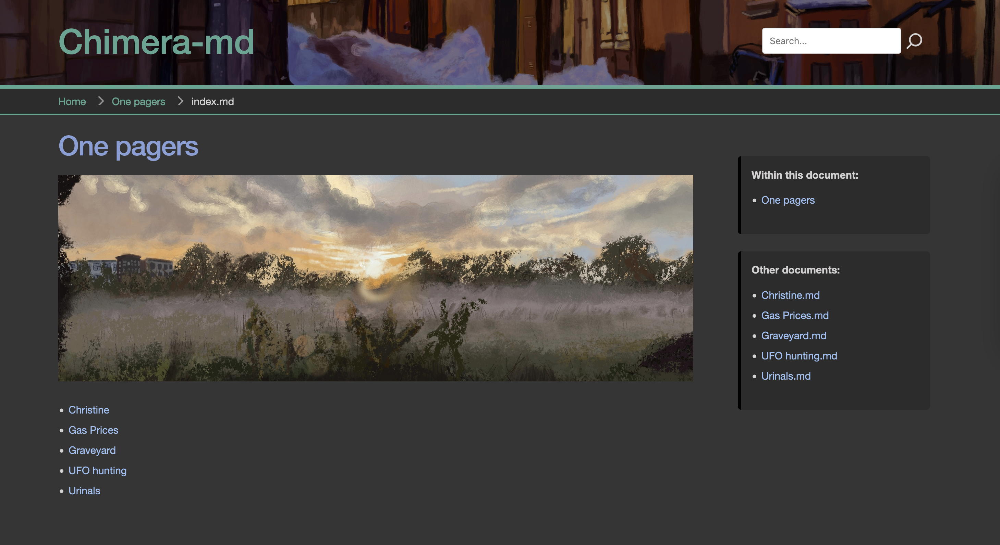

# Chimera-md


Chimera-md is a [Markdown](https://www.markdownguide.org/)-aware documentation server.

I have spent years developing a hard drive full of notes and documents written in the
Markdown text processing language, and while it is comparatively easy to view them as
intended in a special editor, most often I would wind up seeing them in plain text form.
I went looking for a server I could host that would serve up HTML-ified versions of
those documents transparently. Most of the tools I found were static site generators,
or had strong opinions about how the document should be formatted.

Chimera-md is my attempt to make a very simple web server that understands and can serve
a library of Markdown files (and supporting assets). It is a full web server
and can handle ordinary files but has special processing for Markdown files.

It is named after the mythical [chimera](https://en.wikipedia.org/wiki/Chimera_(mythology)),
a beast with at least two heads (and sometimes many more!). It represents the multiple
presentations of these files. Looked at one way, they are plain text. Looked at another,
they are fancy HTML.

## Goals

1. Transparently serve Markdown files
2. Built on top of an existing speedy [web server framework](https://docs.rs/axum/latest/axum/)
3. Nice-looking theme
4. Simple site navigation
5. Full text search
6. Syntax highlighting for code blocks
7. Updates automatically when files change

## Installation

The intended way to install is via
[Docker](https://hub.docker.com/repository/docker/acbarrentine/chimera-md/general).

The Docker Compose file is probably the easiest way to get going. The version below should
get you going, but the
[one on Github](https://github.com/acbarrentine/chimera-md/blob/main/docker/compose.yaml)
will probably be more up to date.

HEADS UP: BREAKING CHANGES as of v0.4.0!

```yaml
version: '3.8'
services:
  chimera-md:
    container_name: chimera-md
    image: acbarrentine/chimera-md:latest
    ports:
      - "8080:8080"

    volumes:
      # Your chimera.toml config file
      - /volume1/docker/dismal-ink/chimera.toml:/data/chimera.toml

      # Markdown document root, media files, etc -- Point this to your main documents folder
      # Serves from /home
      - /volume1/docker/dismal-ink/home:/data/home

      # Logging directory
      - /volume1/docker/dismal-ink/log:/data/log

      # Temporaries directory needed by the full text search
      - /volume1/docker/dismal-ink/search:/data/search

      # Anything after point this is optional

      # Web root, for non-markdown files, such as favicon.ico, robots.txt, or site CSS files
      # Serves from /
      # - /volume1/docker/dismal-ink/www:/data/www

      # You can customize by overriding the built-in Tera HTML templates
      # See customization in readme.md
      # - /volume1/docker/dismal-ink/templates:/data/template

      # You can map additional media files into your /home folder if they live somewhere else
      # - /volume1/docker/dismal-ink/home/media:/data/home/media

    restart: unless-stopped
```

The config file in [TOML](https://toml.io/en/) format. Every field has a default, and the
Docker image provides a stub file, so the server should be able to start up provided you
have mapped reasonable values above. But there's a good chance you'll want to override
some of this content. Example with defaults included here:

```toml
# When used in Docker, these are probably the only fields you may want to change
site_title = "My documents"
site_lang = "en"
generate_index = false

# But the rest of these are available if you want to tune things
index_file = "index.md"
highlight_style = "an-old-hope"
log_level = "Info"
max_cache_size = 52428800

[redirects]
# You can list as many redirects here as you'd like
# "original URL" = "new URI"
# 
# URIs should be absolute, except the left one should not have a preceding /
#
# Example:
# "original-uri/" = "/home/path/to/new/uri.md"

[menu]
# Items to appear in the navigation menu drop-down
# "label" = "URL"
"Home" = "/home/index.md"
```

Note that while Chimera-md is a web server, it is not trying to solve all problems a web server
can be asked. There is no CGI plug-in model. It doesn't handle SSL (TLS) certificates. If you
want authenticated traffic (and you probably do!), you should run it behind a reverse proxy like
[nginx](https://nginx.org/en/) or [Traefik](https://traefik.io/). 

## Managing documents

If you, like me, haven't been putting files in any semblance of order as they accumulate, you
might feel at a loss how to make a single folder that indexes them all. And that's what the web
root is — the starting point for serving up all your documents.

The basic organizational structure you'll want is an `index.md` file in each interesting directory
that points to the files you want to show and to the other folders you want to have reachable from
there. This doesn't have to be a tree structure, but that's a good way to start. If you don't have
an index file, but `generate_index` is set to `true`, the server will make a best guess from
the contents of a folder (showing anything with a .md extension). That setting will also populate
a sidebar panel on markdown documents linking to discovered peers. Consider dressing up your index
documents with pictures to make them look sharp!

If you don't have a tree-like structure, you can use Docker volume mappings to invent one. As long
as mappings don't target the same exact Docker directory, they can overlap however you'd like. I
have a bunch of Synology "shared folder" mount points mapped into the one document folder, which
presents as a very serve-able tree.



In Docker, the left side of the mapping is the real, physical path; the right side is how it
presents in the container. Supposing you have a home directory that contains your main documents
folder, you could map it this way:

```yaml
    volumes:
      - /users/fancy/documents:/data/home
```

Then add additional folders in by creating sub-folder mappings:

```yaml
      - /users/wifey/budget:/data/home/budget
      - /users/kiddo/minecraft:/data/home/minecraft
```

You can also target specific files

```yaml
      - /users/fancy/automation/readme.md:/data/home/automation.md
```

Note that while the focus of Chimera-md is serving Markdown files, it is a fully capable web
server. Feel free to add other kinds of documents or assets to your pages. Only Markdown files
will be discovered by the full-text indexer, however.

A note about URLs: content inside your document root will be routed on the server through
a common root path called `/home` — this keeps them from potentially colliding with
internal route names controlled by the server. Supposing you had a folder structure like this:

`/users/me/taxes` → `/data/www/taxes`

The `index.md` file inside that folder would have an absolute URL of `/home/taxes/index.md`.
In general, though, relative URLs are sufficient. The root `index.md`, for example, would
refer to that document by `[Taxes](taxes/index.md)`. I find it comes up most often for image
references. A file such as `/data/www/images/logo.png` would route as `/home/images/logo.png`

## Customizing the server

There's a few different possible levels of customization points for the Chimera-md server. In
increasing complexity, these are:

1.  `/style/site.css`

    The default Chimera-md header template references three CSS files. Two are termed internal
    use, but the third, `/style/site.css` is intended for end-user customization. In there,
    you can adapt the site style as you see fit. There is a set of CSS color variables to
    make broad color changes easy. An example of this file is provided on
    [Github](https://github.com/acbarrentine/chimera-md/blob/main/example/www/style/site.css).

    If you map a `/data/www/style/site.css` file in Docker, or, more likely, add
    `/style/site/css` to a folder you have already mapped to `/data/www`, Chimera-md will
    serve it instead of the built-in stub.

    You can make your own `site.css` file and map it over the Docker image using a file
    mapping:

```yaml
        volumes:
        - /docker/chimera-md/site.css:/data/www/style/site.css
```

2.  `/favicon.ico`

    Like `site.css`, you can put your own `favicon.ico` in the `/data/www` root and it will
    serve instead of the built-in stub.

3.  If you want to dig in a little deeper, you can augment or override the built-in [Tera
    HTML templates](https://keats.github.io/tera/docs/). Place your files in `/data/template`
    and Chimera-md will index and serve them on request. If they have the same names as the
    built-ins, it will replace it, but you can also request a different template for a
    given markdown file by adding a Yaml frontmatter, like so:

    ```markdown
    ---
    template: dialog.html
    ---

    # Comic script
    ```

    The built-in template pages include requests to two temples that are basically empty
    and intended for user substitution. They are called `site-header.html` and
    `site-footer.html`.

    All of these can added with a single Docker volume mapping:

```yaml
      - /volume1/docker/dismal-ink/templates:/data/template
```

## Release notes

### v0.4.10

* I've been working to improve Chimera-md's content layout shift (CLS) score. As an
  amateur web developer, it has involved a fair bit of firing blind at a poorly
  understood target. Today's update changes the breadcrumb separator from an SVG
  image into a little unicode character: `»`. Because the breadcrumbs indicators
  are created by CSS, they don't apparently support height and width info.

### v0.4.9

* Adds a multi-arch builder to the Docker build procedure, so Chimera-md can now
  run natively on Linux in both x86_64 and Arm64 architectures. It seems like there
  should be a Mac-native way to run it too, but this is a good upgrade

### v0.4.8

* Just added size information to a couple of the image elements to optimize page
  loading

### v0.4.7

* Fix bug with configured redirects. They were not firing for non-/home routes

### v0.4.6

* Updated structure of image cache file to make it easier to order contents

### v0.4.5

* Fix bug with image dimension setting in the HTML generator

### v0.4.4

* Adds support for an image size cache. One of the challenges with markdown HTML conversion
  is that it doesn't have support for setting image sizes, so the resultant pages can hop
  around when image loading is slow. The HTML generator will now look up images in the cache
  and if the size is know, include `height` and `width` attributes for it. Specify the name
  of the cache file in your config like so:

```toml
image_size_file = "image-sizes.toml"
```
  
  File path is relative to the chimera root. The format of the file is intended for tool
  generation, so it looks a little funky to human eyes. It looks like this:

```toml
[map."/home/assets/img-1.jpg"]
width = 4032
height = 3024
```

  And is generated with serde/toml serialization of these structures:

```rust
#[derive (Deserialize, Debug)]
pub struct WidthAndHeight {
    pub width: u32,
    pub height: u32,
}

#[derive (Deserialize, Debug, Default)]
pub struct ImageSizeCache {
    map: HashMap<String, WidthAndHeight>,
}
```

  There is a limitation with this system currently. The cache is not live updating, so you'd have
  to restart the server to pick up changes. I'll address that in a future patch

### v0.4.3

* Documentation update. See below. Important stuff!

### v0.4.2

* I have stabilized the directory structure. (At least I think I have!) It is safe to grab
  again. The log line for this change is that I separated out the user content folder, what
  is called `/home` in the web server's perspective, out from the root service folder, `www`.

  I did that because I had a routing problem with my original setup, which Google flagged
  me. `/home/whatever` paths served successfully from `/whatever`, making the URLs ambiguous.
  I attempted to fix it in v0.3.8, and while that eliminated the ambiguity, it inadvertently
  broke access to stuff in the root directory, such as the favicon, robots.txt, and so on.

  I also eliminated a lot of the config variables in an attempt to make configuration and
  deployment easier. It is likely your `chimera.toml` will still work, but your Docker
  `compose.yaml` will require updates. So re-read the updated
  [installation section](#installation) about setup above to get things back in working
  order.

### v0.4.1

### v0.4.0 BREAKING CHANGE!

* Big restructuring of the files. Things will be unstable for a while. I will update when
  I have things stabilized again.

### v0.3.8

* Trying out a couple things with this release. I have added a `cache-control` header to
  the responses to tell caching layers (like CloudFlare) that it's ok to remember things.
  The other item is that the back-end is providing a new variable `uri` to the Tera template
  engine. My intention with that is to combine it with a server name in the site-header.html
  to give a full canonical URL to each page. There's nothing using it in the default install,
  though, so you don't need to worry about it if you don't need. `uri` will start with a
  slash if you intend to use it.

```html
<link rel="canonical" href="https://canonical.server.name{{uri}}" />
```

### v0.3.8

* Fixing an ambiguous routing issue. /path/file.md should not be equivalent to
  /home/path/file.md

### v0.3.7

* Another attempt to get the requester's IP address, this time using the
  [X-Forwarded-For](https://en.wikipedia.org/wiki/X-Forwarded-For) header if you are behind
  a proxy

### v0.3.6

* Push the z-index on the drop-down menu; that seemed to fix the click-through problem
  I was getting. Some fine-tuning to the readme.

### v0.3.5

* Changes menu item HTML from `<a>` to `<button>`. The tap targets were too small for the
  links and on mobile, you'd often wind up clicking through to something underneath

### v0.3.4

* Adds a drop-down navigation menu on the right side of the breadcrumb bar. Entries in the
  menu are specified in the `chimera.toml` config file. Example:

```toml
[menu]
# Items to appear in the navigation menu drop-down
# "label" = "URL"
"Home" = "/home/index.md"
"Tests" = "/home/tests/index.md"
"Subfolder" = "/home/subfolder/index.md"
```

### v0.3.3

* Adds the client IP address to log lines

### v0.3.2

* Making the redirect mappings use permanent redirection. Fingers crossed they're working!

### v0.3.1

* The server now logs output both to the TTY and a log file. Referer and user-agent added
  to log statements

### v0.3.0 **BREAKING CHANGE!**

* Adding support for log files. This adds a new field to the config `log_dir`, set to
  `/data/log` by default. Log files rotate daily. You'll need to establish this path
  in the Docker container before it will work

### v0.2.2

* I hit an instance of a thread deadlocking which I believe to be a result of the cache
  failsafe operation I added. This changes the implementation to a message passed to the
  existing compaction thread, which should prevent the lock-in-lock situation I got it
  into before

### v0.2.1

* This contains an attempt to work around a sporadic fault in the directory watcher I'm
  using. I keep having instances where the notifies just seem to drop and the server no
  longer spots file changes. This change adds a backup system the looks at file modtimes
  before serving a file out of the cache. That doesn't cover all cases, but it should be
  a pretty good equivalent

### v0.2.0 **BREAKING CHANGE!**

* Added support for a table of redirects to the router. This is motivated by the needs
  of my [main website](https://www.dismal.ink/), which I am porting from Wordpress to
  Chimera-ma. I wanted to make some of the old, popular URLs map to their current
  locations
* Because environment variables aren't conducive to making a mapping and the configuration
  was already getting pretty hairy, I wound up moving the config settings over to toml.
  Going forward, you will need to make a site-based toml config file, called chimera.toml
  by default

### v0.1.25

* I am now promoting frontmatter variables through to Tera, the HTML template engine,
  which makes them available to the templates. The current use case is for opengraph
  tags. So, for example, if a post had frontmatter like this:

```yaml
---
Date: 2024-11-14
Title: Exmaple Index
Image: /media/fancy.jpg
Alt: A fancy piece of chocolate art
---
```

  That data would be available in the `__tera_context`, like so:

```html
<meta property="og:image" content="{{Image}}" alt="{{Alt}}">

<meta property="og:description" content="{{Excerpt}}">
<meta property="og:type" content="article">

<meta property="og:type" content="website">

<meta property="og:locale" content="{{site_lang}}">
<meta property="og:site_name" content="{{site_title}}">

<meta property="og:title" content="{{Title}}">

<meta property="og:title" content="{{title}}">

```

### v0.1.24

* Fixed a bug in the frontmatter parser. Turns out, that's Yaml in there! I integrated
  the yaml-rust2 crate to parse it and feed it into the Tera vars as name-value pairs.
  Current implementation is a bit of a hack as it doesn't take into account the
  potentially nested nature of Yaml data. I'll come back around on that soon

### v0.1.23

* Ok, now I think I _have_ fixed the footer thing. When going through the array of server
  timing objects, actually use the one you're iterating on, not the end of the array
* Added a site-header.html template that's basically empty to be used by implementers
  who want to add additional `<head>` content, such as `<meta>`, `<script>`, or `<link>`
  tags

### v0.1.22

* Maybe fixed the footer thing?

### v0.1.21

* Added a customization point to the footer called site-footer.html. The included
  file is mostly empty and the intention is for people to override it with their
  docker mappings
* Updated various support crates
* Troubleshooting the timing bars Javascript widget, so there's an extra console.log()
  I am getting strange results from the site over the public internet, and I need to
  see what the data looks like

### v0.1.20

* Added gzip compression support

### v0.1.19

* Got rid of the plugins notion in favor of using overridden template files
* Added hook for signals (like ctrl-C) to shut the server down cleanly
* Two-column index layout

### v0.1.18

* Tried out a version of making a directory tree, rather than a single, flat folder
  for the sidebar and generated indices. Ultimately I decided I didn't like it and
  backed it out, but along the way I got to clean up a fair bit of the code
* Fixed a couple rendering issues with the sidebar

### v0.1.17

* Used `server-timing` http header, which is the only response header web clients allow
  Javascript to read, to render the response timing directly in the page.
* Figured out how to do my dialog plugin without jquery, using straight Javascript. As
  a result, I removed jquery from the html generator

### v0.1.16

* Fixed the search results template (it was closing the `<ol>` prematurely)
* Added a performance timing component
* Added the ability to specify an alternate Tera template to render against. The only
  use for this at the moment is letting you make an index.md file that doesn't need to
  list out the file contents. index.html uses the same file discovery component
  as the sidebar. To use the feature, in a Markdown document's header, use:

```markdown
---
template: index.html
---
```

### v0.1.15

* Fixed bug with heading jump-lists (one side was getting slugified and the other was not)
* Fixed the html generator's file watcher so it would dump the cache if an html file (Tera
  template) changed, instead of the old .hbs (Handlebars template) files

### v0.1.14

* Swapped out the Handlebars templating system for [Tera](https://keats.github.io/tera/).
  Tera is both faster and has more functionality
* Made the file names in the sidebar use stems (no extensions)

### v0.1.13

* Added little .svg icons to the sidebars
* Cleaned up the full text indexer's file discovery

## Non-Docker installation

You rebel! Well, I don't have precompiled binaries, so the easiest way to go
about getting a non-Docker install is to [clone the depot](https://github.com/acbarrentine/chimera-md)
and build it from source. It is a standard [Rust](https://www.rust-lang.org/) project
and should compile on just about any platform.

One interesting thing I noted while developing this. While running it locally prevents
the use of Docker directory mapping, I was able to use soft links to present a unified
folder structure under the document root. The server was able to navigate them just fine.
That does not appear to be the case in the Docker version, however.

`cargo run` will compile and run the project. As noted above, there are environment
variables for controlling the behavior, and more of them will be applicable here. You
can either use the environment, or specify them on the command line.

`bacon example` will compile and run the `example` web content and keep watch on the
source directories for changes. You can make your own configuration in `bacon.toml`
by [cloning and editing](https://dystroy.org/bacon/#configuration) the `example` job.

## Arguments

The only command line argument is the path to the config TOML file. Call it with

```bash
chimera-md --config-file=example.toml
```

## Contributing

I'm pretty new to this whole open source world, but I welcome contributors and
feedback! Feel free to file [pull requests](https://github.com/acbarrentine/chimera-md/pulls)
for new features and [flag bugs](https://github.com/acbarrentine/chimera-md/issues). It takes
a village!

## Roadmap

What does the future hold? It's hard to say. Some possible future directions include:

1. Progressive search results
2. User authentication and restricting content to particular users
3. Additional navigation customization options
4. Editing or uploading of Markdown files

It all depends on you. What do you want to see?

## Acknowledgements

* I want to call out [this video by Rainer Stropek](https://www.youtube.com/watch?v=y5W6PErCc2c) for the
very cogent guide to using Axum. It was a huge help.
* Icons come from the [Ionicons](https://ionic.io/ionicons) SVG library

## Libraries

Chimera-md uses the following open source libraries:

* [Skeleton CSS framework](http://getskeleton.com/)
* [Axum web framework](https://github.com/tokio-rs/axum)
* [Tera](https://keats.github.io/tera/)
* [pulldown-cmark](https://crates.io/crates/pulldown-cmark)
* [Tantivy](https://crates.io/crates/tantivy)
* [tokio](https://tokio.rs/)
* [tower-http](https://crates.io/crates/tower-http)
* [tracing](https://crates.io/crates/tracing)
* [serde](https://crates.io/crates/serde)
* [clap](https://crates.io/crates/clap)
* [regex](https://crates.io/crates/regex)
* [urlencoding](https://crates.io/crates/urlencoding)
* [walkdir](https://crates.io/crates/walkdir)
* [async-watcher](https://crates.io/crates/async-watcher)
* [toml](https://crates.io/crates/toml)
* [indexmap](https://crates.io/crates/indexmap)
* [slugify](https://crates.io/crates/slugify)
* [yaml-rust2](https://crates.io/crates/yaml-rust2)
* [toml](https://crates.io/crates/toml)

## License

This project is open sourced under the MIT [License](License.txt)
